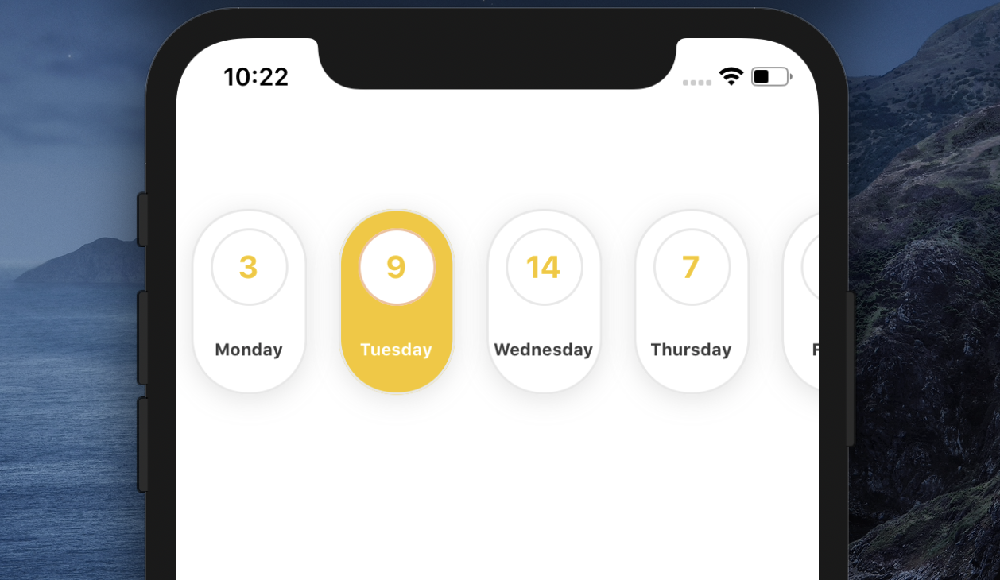
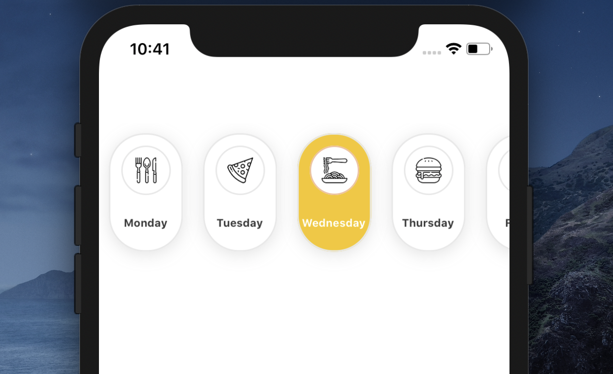

# Demo

<table>
<tr>
    <td align="center">
  
  </td>
    <td align="center">
  
</td>
  </tr>
  <tr>
  
  </tr>
</table>

# Installation

Add the dependency:

```ruby
npm i react-native-big-tab-bar
```

## Peer Dependencies

###### IMPORTANT! You need install them

```js
"react-native-androw": "0.0.34"
```

`

## Import

```jsx
import BigTabBar from "react-native-big-tab-bar";
```

# Usage

```
<BigTabBar tabs={tabs} />
```

## Data Model

```
export type ITabBar = {
id: number;
text: string;
number?: number;
image?: any;
};
```

## Example Data

```jsx
[
  {
    id: 0,
    bottomText: "Monday",
    innerText: "8",
  },
  {
    id: 1,
    bottomText: "Tuesday",
    image: {
      uri: "https://image.winudf.com/v2/image/Y29tLnNnbS5iZWFjaHdhbGxwYXBlcmhkX3NjcmVlbnNob3RzXzJfZjRhOGQ4MzQ/screen-2.jpg?fakeurl=1&type=.jpg",
    },
  },
  {
    id: 2,
    bottomText: "Wednesday",
    innerText: "14",
  },
  {
    id: 3,
    bottomText: "Thursday",
    image: { uri: "https://images2.alphacoders.com/468/4682.jpg" },
  },
];
```

## Example Usage

```jsx
<BigTabBar tabs={tabs} />
```

## Configuration - Props

| Property                |   Type   |  Default  | Description                                                                               |
| ----------------------- | :------: | :-------: | ----------------------------------------------------------------------------------------- |
| tabs                    |  array   |           | Set your tab bar items                                                                    |
| itemStyle               |  style   |  default  | set your custom item button style                                                         |
| height                  |  number  |    120    | set your custom item height value                                                         |
| width                   |  number  |    72     | set your custom item width value                                                          |
| bottomTextStyle         |  style   |  default  | set your custom text style                                                                |
| selectedItem            |  number  |     0     | set your initial item                                                                     |
| innerContainerHeight    |  number  |    50     | set the height of the inner container                                                     |
| innerContainerWeight    |  number  |    50     | set the width of the inner container                                                      |
| activeBackgroundColor   |  string  | "#F5C812" | set your active background color                                                          |
| inActiveBackgroundColor |  string  | "#faeed9" | set the background color when it is inactive                                              |
| inActiveTextColor       |  string  | "#6e685f" | set the text color when it is inactive                                                    |
| activeTextColor         |  string  |  "#fff"   | set the text color when it is active                                                      |
| ImageComponent          |  Image   |   Image   | set on your own Image Component                                                           |
| imageStyle              |  style   |  default  | set your custom image style                                                               |
| innerActiveTextColor    |  string  | "#F5C812" | if there are numbers in the inner container, you can change the color when it is active   |
| innerInActiveTextColor  |  string  | "#F5C812" | if there are numbers in the inner container, you can change the color when it is inactive |
| innerTextStyle          |  style   |  default  | set your custom text style                                                                |
| onPress                 | function | undefined | set your own function when onPress                                                        |
| onChange                | function | undefined | set your own function when onChange                                                       |

## Author

Sevval Eygul, sevvalleygull@gmail.com

## License

React Native Big Tab Bar is available under the MIT license. See the LICENSE file for more info.
